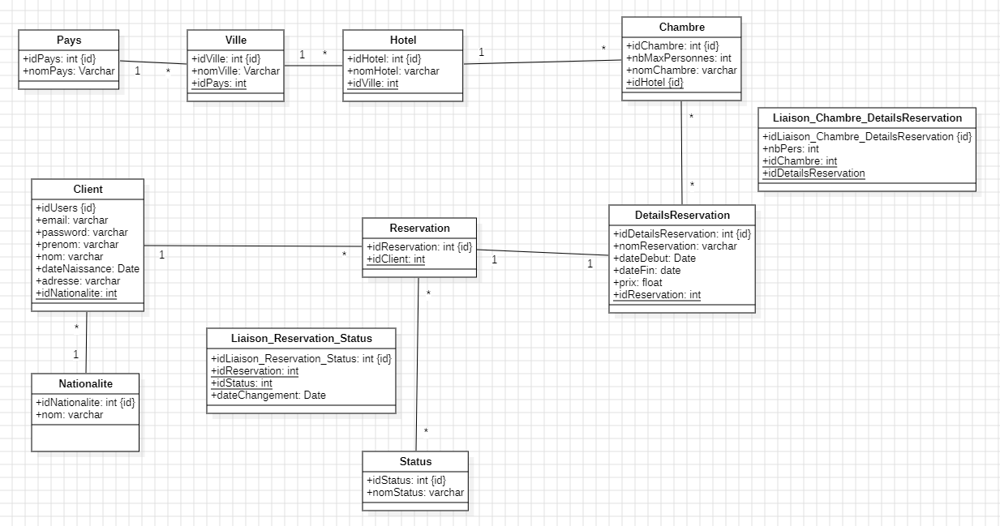

# Hotel Reservation

# 👩‍💻 Technologies

| Back - Spring Boot | version (works) | 
| --- | --- |
| java | 22 |
| maven| 3.9.6 |
| Docker| 26.1.1 |

# 🛠 Project and funtionnalities

✅ 

# Database UML



# ⚡️ Standard Execution

Start postgresql database

```bash
docker-compose up
```

Destroy database

```bash
docker-compose down -v
```

Start API REST

```bash
mvn spring-boot:run
```

URL of Swagger: http://localhost:8080/swagger-ui.html